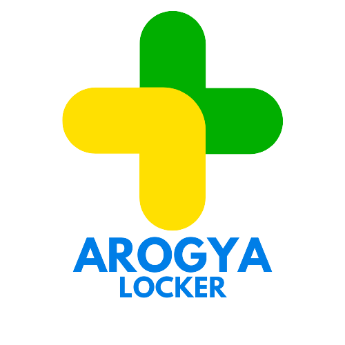
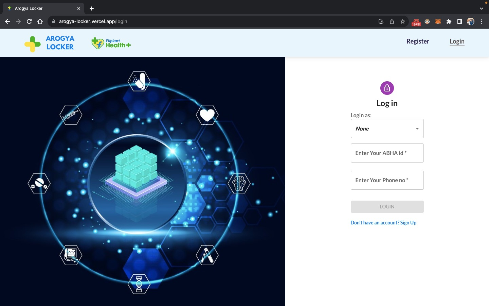
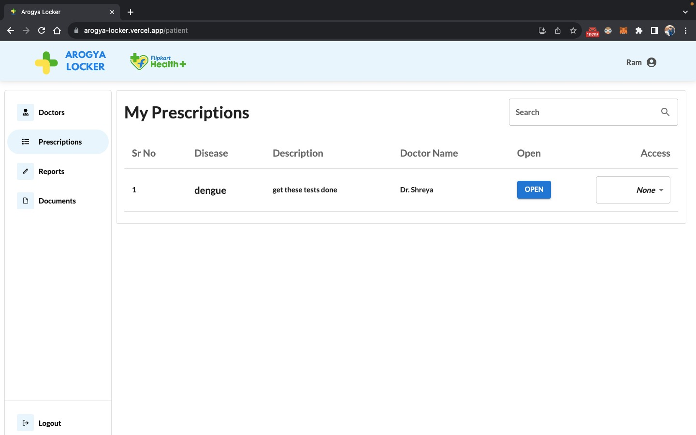
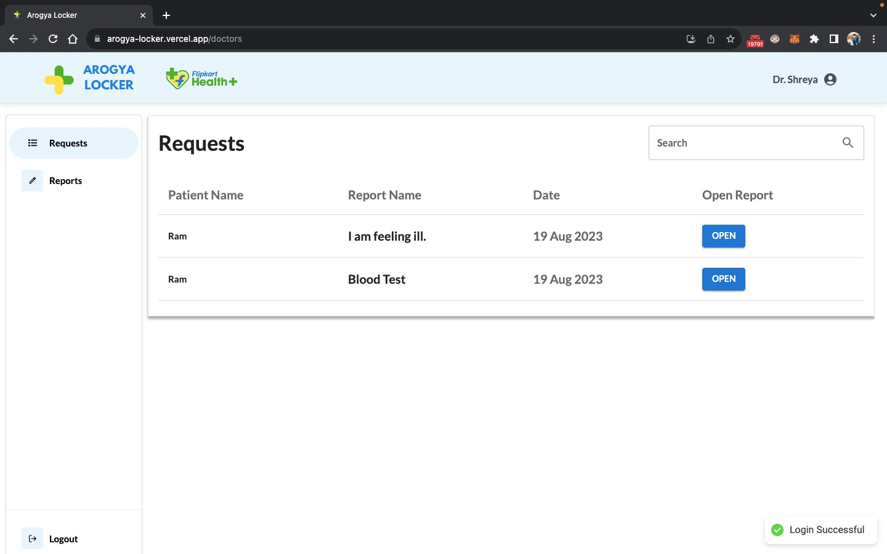

<!-- Improved compatibility of back to top link: See: https://github.com/othneildrew/Best-README-Template/pull/73 -->
<a name="readme-top"></a>
<!--
*** Thanks for checking out the Best-README-Template. If you have a suggestion
*** that would make this better, please fork the repo and create a pull request
*** or simply open an issue with the tag "enhancement".
*** Don't forget to give the project a star!
*** Thanks again! Now go create something AMAZING! :D
-->


<!-- PROJECT SHIELDS -->
<!--
*** I'm using markdown "reference style" links for readability.
*** Reference links are enclosed in brackets [ ] instead of parentheses ( ).
*** See the bottom of this document for the declaration of the reference variables
*** for contributors-url, forks-url, etc. This is an optional, concise syntax you may use.
*** https://www.markdownguide.org/basic-syntax/#reference-style-links
-->
[![Contributors][contributors-shield]][contributors-url]
[![Forks][forks-shield]][forks-url]
[![Stargazers][stars-shield]][stars-url]
[![Issues][issues-shield]][issues-url]
[![MIT License][license-shield]][license-url]
[![LinkedIn][linkedin-shield]][linkedin-url]


<!-- PROJECT LOGO -->
<br />
<div align="center">
  <a href="https://github.com/sahil9510/arogya-locker">
    
  </a>

  <h3 align="center">Arogya Locker</h3>

  <p align="center">
Arogya Locker aims to transform EHRs with Blockchain by enforcing privacy, interoperability and security
    <br />
    <a href="https://github.com/sahil9510/arogya-locker"><strong>Explore the docs »</strong></a>
    <br />
    <br />
    <a href="https://arogya-locker.vercel.app/">View Deployed</a>
    ·
    <a href="https://www.youtube.com/watch?v=zkX1JqDF2RY">View Demo Video</a>
    ·
    <a href="https://github.com/sahil9510/arogya-locker/issues">Report Bug</a>
    ·
    <a href="https://github.com/sahil9510/arogya-locker/issues">Request Feature</a>
  </p>
</div>


<!-- TABLE OF CONTENTS -->
<details>
  <summary>Table of Contents</summary>
  <ol>
    <li>
      <a href="#about-the-project">About The Project</a>
      <ul>
        <li><a href="#built-with">Built With</a></li>
      </ul>
    </li>
    <li>
      <a href="#getting-started">Getting Started</a>
      <ul>
        <li><a href="#prerequisites">Prerequisites</a></li>
        <li><a href="#installation">Installation</a></li>
      </ul>
    </li>
    <li><a href="#usage">Screenshots</a></li>
    <li><a href="#contributing">Contributing</a></li>
    <li><a href="#license">License</a></li>
    <li><a href="#contact">Contact</a></li>
  </ol>
</details>


<!-- ABOUT THE PROJECT -->
## About The Project

[![Product Name Screen Shot][product-screenshot]](https://arogya-locker.vercel.app/)


Arogya locker digitizes the process of health record and reports management by storing them on blockchain using IPFS. These records could be patients personal health docs, reports and prescriptions.
We have used IPFS (Inter Planetary File System) for file storage that eliminates data redundancy by storing only one copy of identical resources which also saves storage. 
IPFS also ensures authenticity and and uniqueness by creating a CID for each resource that serves as a digital fingerprint.
There are four types of users :

* Patient
* Doctor
* Hospital
* Diagnostics

Each has a separate interface.

Arogya Locker enables a two way communication mechanism for doctor and patient while file sharing is done by a secure access providing system. Files can be shared as images or PDFs.
Therefore records are highly secure and have authorised access. They are only accessible by the owner or to whom access is granted.
A search functionality enables easy navigation between various documents.

<p align="right">(<a href="#readme-top">back to top</a>)</p>


### Built With

The technologies involved in building Arogya Locker are:

[![React][React.js]][React-url]
<br/>
React is a popular front-end JavaScript library that is used to build user interfaces. It provides a simple and flexible way to create dynamic and responsive user interfaces. React is based on a component-based architecture, which makes it easy to reuse and maintain code.

<br/>


[![Node.js][Node.js]][Node.js-url]
<br/>
Node.js is a server-side JavaScript runtime environment that is used to build scalable and high-performance applications. Node.js allows you to use JavaScript on the server-side, which makes it easy to build full-stack web applications with a single language. It provides a rich set of libraries and tools that make it easy to build web applications.

<br/>

[![ExpressJS][ExpressJS]][ExpressJS-url]
<br/>
Express.js is a web application framework that is used to build APIs and handle HTTP requests. It is built on top of Node.js and provides a simple and flexible way to build web applications. With Express.js, you can easily define routes, handle requests, and manage middleware.

[![Solidity][Solidity]][Solidity-url]
<br/>
Solidity is an object-oriented, high-level language for implementing smart contracts. Smart contracts are programs that govern the behavior of accounts within the Ethereum state.

<br/>

[![IPFS][IPFS]][IPFS-url]
<br/>
The Interplanetary File System (IPFS) is a distributed file storage protocol that allows computers all over the globe to store and serve files as part of a giant peer-to-peer network.
<br/>

<p align="right">(<a href="#readme-top">back to top</a>)</p>


<!-- GETTING STARTED -->
## Getting Started

Step-by Step setup guide:

### Prerequisites

* npm
  ```sh
  npm install npm@latest -g
  ```


### Installation


1. Get a free Infura IPFS ID and secret key at [www.infura.io/](https://www.infura.io/)

2. Get a free Infura Sepolia Testnet API Key at [www.infura.io/](https://www.infura.io/)
3. Create a blockchain wallet account on any wallet provider like Metamask.

4. Get some test ethers in Sepolia network from [sepoliafaucet.com](https://sepoliafaucet.com/)
4. Store your account's wallet address by following [this](https://isitcrypto.com/find-metamask-wallet-address/)

5. Store your account's private address by following [this](https://support.metamask.io/hc/en-us/articles/360015289632-How-to-export-an-account-s-private-key#:~:text=On%20the%20'Account%20details'%20page,private%20key%20to%20your%20clipboard.)


<!-- 6. Create a MongoDB Atlas Cluster -->
<!-- 7. In all three folders run:
   ```sh
   npm install --force
   ``` -->
6. Install NPM packages in all three folders
   ```sh
   cd frontend
   npm install --force
   ```

   ```sh
   cd backend
   npm install
   ```

   ```sh
   cd blockchain
   npm install
   ```

_For contract deployment:_

7. Create a .env file in blockchain:
   ```
   PRIVATE_KEY= 'your-account-private-key'
   RPC_URL = 'your-infura-rpc-url'
   ```

8. Run following commands in the terminal:
    ```sh
    cd blockchain
    npx hardhat compile
    ```
    ```sh
    npx hardhat run scripts/deploy.js --network sepolia
    ```

9. You will get a address for your contract in the terminal. Save it for further use.

_For starting backend:_

10. Create a .env file in backend:
    ```
    INFURA_ID='your-infura-id'
    INFURA_SECRET_KEY ='your-infura-secret-key'

    ACCOUNT_ADDRESS= 'your-wallet-address'
    ACCOUNT_PRIVATE_KEY= 'your-wallet-private-address'
    RPC_URL = 'your-infura-rpc-url'
    ```
12. In backend/config.js:

    ```js
    module.exports.CONTRACT_ADDRESS = "your-contract-address"
    ```

11. Run the following command to start server:
    ```sh
    cd backend
    node app.js
    ```

_For starting frontend:_

12. Create a .env file in frontend:
    ```
    REACT_APP_API_URL = 'http://localhost:5000' or 'server-deployment-link'

    REACT_APP_INFURA_ID = 'your-infura-id'
    REACT_APP_INFURA_SECRET_KEY = 'your-infura-secret-key'
    ```
13. Run the following command to start the React App:

    ```sh
    cd frontend
    npm start
    ```
<p align="right">(<a href="#readme-top">back to top</a>)</p>


<!-- USAGE EXAMPLES -->
## Screenshots
### Identity Management

<br/>

Arogya Locker uses ABHA ID for identity management. The ABHA IDs are stored on the blockchain on user registration and verified on login. Identity is also managed on a category level: Patient, Doctor, Hospital and Diagnostic Centres.

### Access Mechanism

<br/>

File storage is done using IPFS  that eliminates data redundancy by storing only one copy of identical resources. This also saves storage.IPFS also ensures authenticity and uniqueness by creating a CID for each resource that serves as a digital fingerprint.
Documents are shared by an access control mechanism by which owner can provide access to their document when required.

### Add Prescription

<br/>

Doctor can respond to requests by adding a prescription, attaching the required documents and sending it to the patient.

### Patient Dashboard

<br/>

Patient can view the list of doctors and contact them as required. This ensures a two way communication between patient and doctor. Patient can also view reports sent by diagnostic labs, prescription received and PHRs. PHRs can also be added by the patient.

### Doctor Dashboard

<br/>

Doctor can view requests sent by patients and respond to them via a prescription. Also they can vheck the prescriptions sent under Reports tab.

_For more examples, please refer to the [site](https://arogya-locker.vercel.app/)_

<p align="right">(<a href="#readme-top">back to top</a>)</p>


<!-- CONTRIBUTING -->
## Contributing

Contributions are what make the open source community such an amazing place to learn, inspire, and create. Any contributions you make are **greatly appreciated**.

If you have a suggestion that would make this better, please fork the repo and create a pull request. You can also simply open an issue with the tag "enhancement".
Don't forget to give the project a star! Thanks again!

1. Fork the Project
2. Create your Feature Branch (`git checkout -b feature/AmazingFeature`)
3. Commit your Changes (`git commit -m 'Add some AmazingFeature'`)
4. Push to the Branch (`git push origin feature/AmazingFeature`)
5. Open a Pull Request

<p align="right">(<a href="#readme-top">back to top</a>)</p>


<!-- LICENSE -->
## License

Distributed under the MIT License. See `LICENSE.txt` for more information.

<p align="right">(<a href="#readme-top">back to top</a>)</p>


<!-- CONTACT -->
## Contact

Contributors: 

[@srivastv_Sahil](https://twitter.com/srivastv_Sahil) - srivastavasahil133@gmail.com

[@saketm_07](https://twitter.com/saketm_07) - saketmundra2707@gmail.com

[@SrishtiDharwani](https://twitter.com/SrishtiDharwani) - srishti.dharwani.30@gmail.com

Project Link: [https://github.com/sahil9510/arogya-locker](https://github.com/sahil9510/arogya-locker)


<p align="right">(<a href="#readme-top">back to top</a>)</p>


<!-- MARKDOWN LINKS & IMAGES -->
<!-- https://www.markdownguide.org/basic-syntax/#reference-style-links -->
[contributors-shield]: https://img.shields.io/github/contributors/sahil9510/arogya-locker.svg?style=for-the-badge
[contributors-url]: https://github.com/sahil9510/arogya-locker/graphs/contributors
[forks-shield]: https://img.shields.io/github/forks/sahil9510/arogya-locker.svg?style=for-the-badge
[forks-url]: https://github.com/sahil9510/arogya-locker/network/members
[stars-shield]: https://img.shields.io/github/stars/sahil9510/arogya-locker.svg?style=for-the-badge
[stars-url]: https://github.com/sahil9510/arogya-locker/stargazers
[issues-shield]: https://img.shields.io/github/issues/sahil9510/arogya-locker?style=for-the-badge
[issues-url]: https://github.com/sahil9510/arogya-locker/issues
[license-shield]: https://img.shields.io/github/license/sahil9510/arogya-locker.svg?style=for-the-badge
[license-url]: https://github.com/sahil9510/arogya-locker/blob/main/LICENSE.txt
[linkedin-shield]: https://img.shields.io/badge/-LinkedIn-black.svg?style=for-the-badge&logo=linkedin&colorB=555
[linkedin-url]: https://www.linkedin.com/in/sahil9510/
[product-screenshot]: frontend/src/Assets/homepage.png
[Next.js]: https://img.shields.io/badge/next.js-000000?style=for-the-badge&logo=nextdotjs&logoColor=white
[Next-url]: https://nextjs.org/
[React.js]: https://img.shields.io/badge/React-20232A?style=for-the-badge&logo=react&logoColor=61DAFB
[React-url]: https://reactjs.org/
[Node.js]: https://img.shields.io/badge/Node.js-68A063?style=for-the-badge&logo=nodedotjs&logoColor=3C873A
[Node.js-url]: https://nodejs.org/en
[Angular.io]: https://img.shields.io/badge/Angular-DD0031?style=for-the-badge&logo=angular&logoColor=white
[Angular-url]: https://angular.io/
[Svelte.dev]: https://img.shields.io/badge/Svelte-4A4A55?style=for-the-badge&logo=svelte&logoColor=FF3E00
[Svelte-url]: https://svelte.dev/
[Laravel.com]: https://img.shields.io/badge/Laravel-FF2D20?style=for-the-badge&logo=laravel&logoColor=white
[Laravel-url]: https://laravel.com
[ExpressJS]: https://img.shields.io/badge/ExpressJS-white?style=for-the-badge&logo=express&logoColor=black
[ExpressJS-url]: https://expressjs.com/
[Solidity]: https://img.shields.io/badge/Solidity-E8E7D5?style=for-the-badge&logo=solidity&logoColor=1C1C1C
[Solidity-url]: https://soliditylang.org/
[IPFS]: https://img.shields.io/badge/IPFS-0b2733?style=for-the-badge&logo=ipfs&logoColor=3285a8
[IPFS-url]: https://ipfs.tech/